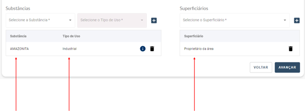

É possível filtrar os parcelamentos?
============================================================

Sim! Para você filtrar algum parcelamento, vá na opção “Selecione o Débito” do Sistema.
 Lá, você encontrará as seguintes opções de filtragem:
 Tipo de Débito 
 Identificador do Documento
 Número do Processo de Cobrança
 Data de Vencimento

