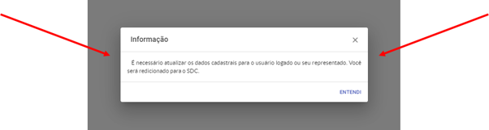

Quais são as funcionalidades do sistema do Sinarc para o minerador?
===========================================================================

No Portal do Minerador você vai encontrar duas funcionalidades:
Solicitar o parcelamento de alguma autuação aplicada pela ANM;
Gerar o boleto para pagamento de alguma autuação ou parcelamento

