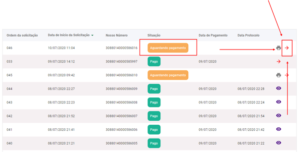
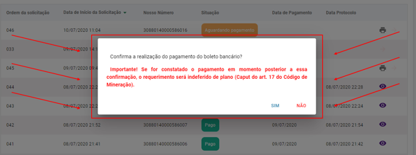
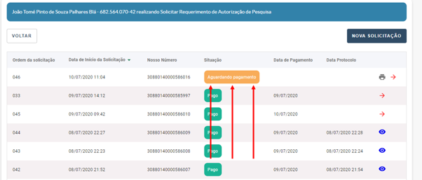
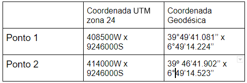
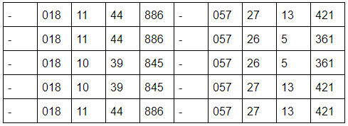

Como realizo um parcelamento da minha autuação? 
============================================================

Primeiro, Passe o cursor do mouse na aba “Parcelamento” no canto superior esquerdo, e clique em “Parcelamento Administrativo”.

Em seguida, abra o manual que corresponde ao “Termo de Ciência”, leia-o e por fim, pressione o botão “Estou Ciente” (que será habilitado) para continuar

.. image:: ../imagens/imagem05.png

.. image:: ../imagens/imagem06.png

Feito isso, agora verifique as informações do Representante (nome, cpf e e-mail) e, caso necessário, adicione mais algum e-mail.

Após solicitar o Parcelamento de alguma multa, caso deseje filtrar este débito, vá na aba “Selecione os Débitos”.

Agora, verifique os débitos encontrados e selecione o que você deseja solicitar o parcelamento.

Nesse ponto, insira a quantidade desejada de parcelas, e caso você seja um Representante de alguma empresa, é necessário também anexar uma Procuração registrada em cartório que comprove a sua posição (em formato PDF).

Pressione o botão salvar e verifique o seu débito na tabela “Resumo de Parcelamento”.

.. image:: ../imagens/imagem0011.png

Neste momento, será exibido um modal com os boletos da primeira parcela em que será necessário realizar o parcelamento, e também você receberá um termo de parcelamento.
