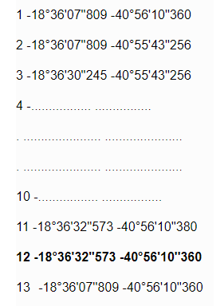

A partir do momento em que recebo uma notificação, qual é o meu prazo de defesa?
=======================================================================

A partir do momento em que recebe uma notificação, você tem 30 dias para se defender. Caso você não se defenda ou sua defesa seja indeferida, ou você será notificado da imposição de multa.

