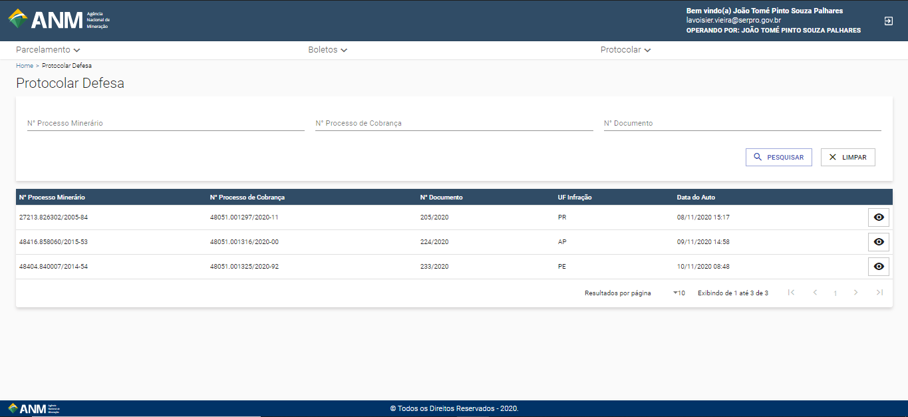

Como entro com defesa/recurso?
============================================================

1- Para Protocolar uma Defesa, é necessário entrar no menu "Protocolar"

2- Aqui, é possível filtrar as suas autuações para realizar o Protocolo de uma Defesa

3- Para maiores detalhamentos e também para a inserção do documento da Defesa, é necessário clicar no ícone visualizar

.. image:: ../imagens/MicrosoftTeams-image (1).png

1- Aqui, é possível visualizar todas as informações referentes à autuação aplicada

2- Para realizar a Anexação de sua Defesa, é necessário seguir os seguintes passos:
- O Arquivo de sua defesa deve ter, no máximo, 10 MB
- A extenção do Arquivo deve ser .PDF
- É possível anexar até 10 documentos

Garantido que o(s) Documento(s) está ok, basta clicar em "ESCOLHER AQUIVO", selecionar a sua defesa, e logo em seguida, clicar em "ANEXAR". Feito isso, o arquivo da sua defesa aparecerá na tabela (item 3). Caso deseje deletar a defesa por algum motivo, basta ir nessa tabela e apertar no ícone de Lixeira (Deletar).
