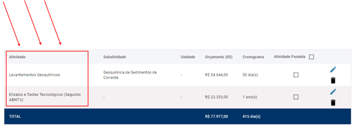
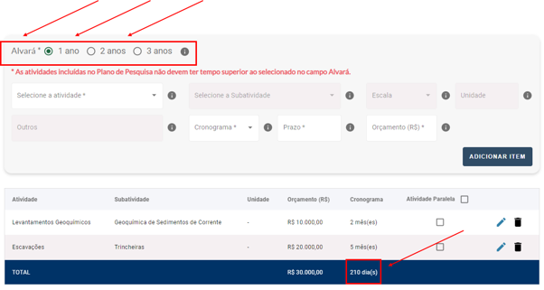
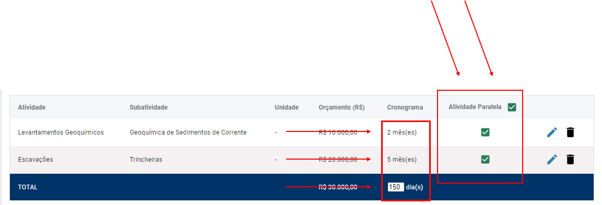

Aonde consigo fazer o download de um boleto?
=======================================================================

Para baixar o boleto de alguma autuação ou parcelamento, primeiramente, basta você entrar na aba “boletos”.

Feito isso, caso deseje, faça a filtragem do débito. 

E, por fim, clique em fazer o download do boleto, que estará apto para pagamento.

